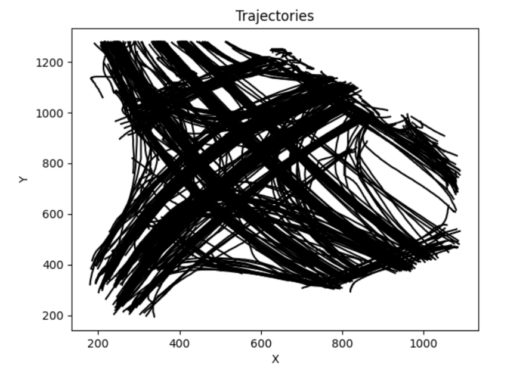
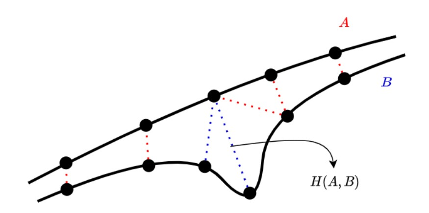
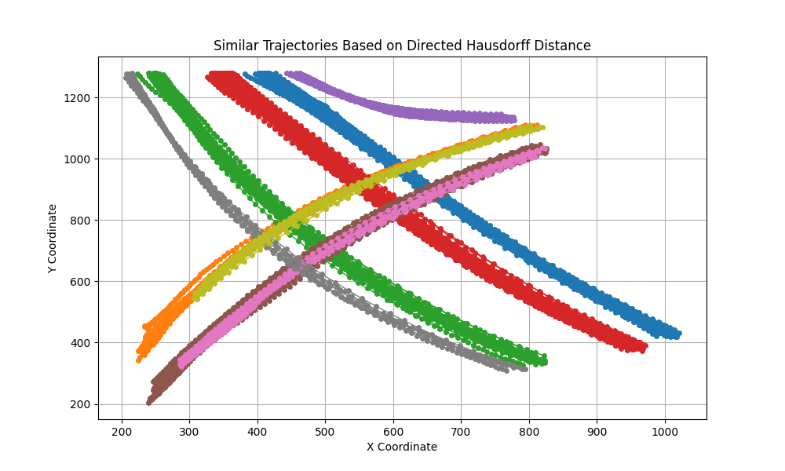

# Trajectory_Analysis
This is a python project that groups 2D trajectories of objects (collected from GPS data - latitude and longitude in geographical terms) in similar direction. An illustration of the input trajectory data is shown in the figure below.



## Installation of dependencies

To install the python dependencies, run:

```shell
pip install -r requirements.txt
```


## Key Concepts

This implementation consists of following parts:
- Loading and pre-processing 2D trajectory data into suitable data structures for further processing.
- Calculating directed hausdorf distance between trajectories to find out similar trajectories.
- Grouping the trajectories based on hausdorf distance through oulier elimination and color mapping similar trajectories.

Directed Hausdorff distance is a way to measure how far apart two sets of points are from each other. Imagine you have two sets of points, let's call them Set A and Set B. The directed Hausdorff distance between these sets tells you the maximum distance a point in Set A needs to travel to get to the closest point in Set B.

The directed Hausdorff distance between sets A and B is given by:

DH(A, B) = max(max(min(d(a, b))) , max(min(d(b, a))))

A small visualisation of the distance metric is provided in the following figure:


## Usage

To run the code, run:

```shell
python main.py
```
Use the config.yaml file change different parameters used in the program.

The visualisation of the 2D trajectories grouped based on direction is given below:



To perform unit testing with some sample test cases, run:
```shell
python -m unittest discover
```


